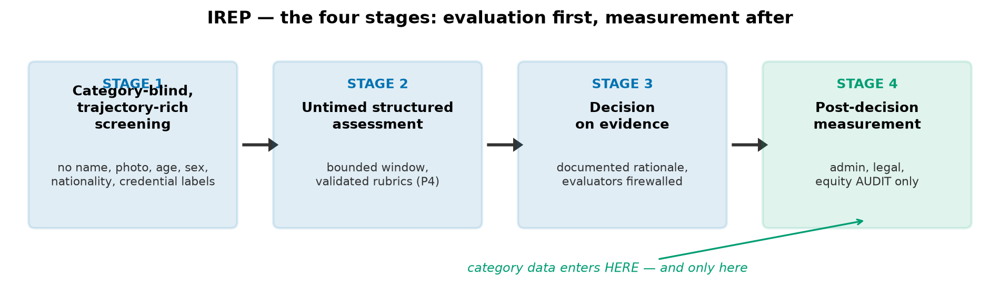
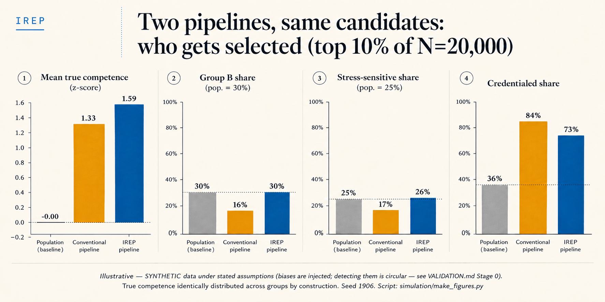

# IREP — Individual-Referential Evaluation Protocol

**An open standard for category-blind, trajectory-rich assessment in hiring and admissions.**

> The right to be evaluated as oneself, and not as one's category, should never have been for sale.

## What this is

IREP is a free, open, implementable protocol for selection processes (employment, and by extension university admissions) that applies what thirty years of research has established and the sector has never operationalized:

- **Category salience harms candidates at evaluation time** (Steele & Aronson, 1995: a checkbox suffices).
- **Category signals bias evaluators** (Bertrand & Mullainathan, 2004, and two decades of audit studies: identical files, different outcomes).
- **Masking alone can backfire** (Behaghel, Crépon & Le Barbanchon: France's anonymous-CV experiment worsened outcomes for the candidates it meant to protect).
- **Deleting the attribute doesn't delete its influence** (algorithmic fairness: categories leak through proxies).

IREP's answer is not to hide category data but to **relocate it in time**: evaluation is category-blind but trajectory-rich; assessment is untimed within a bounded window; demographic and credential data are collected **after** the decision, firewalled from evaluators, and used exclusively for audit, compliance and administration.

**The individual is the reference class. The population is the audit instrument.** In full: the individual is the unit of interpretation; the role is the standard of decision; the population is the instrument of audit.

## The four stages

1. **Category-blind, trajectory-rich screening** — no name, photo, age, sex, nationality, address, or credential labels used as filters; full richness of the candidate's trajectory preserved.
2. **Untimed structured assessment** — bounded window (e.g., 24h), no per-item time pressure; validated, pre-registered rubrics; no unvalidated "cognitive profiling."
3. **Decision on evidence** — documented rationale, by evaluators with zero access to category data.
4. **Post-decision measurement** — administrative and demographic data collected after selection, for contracting, legal declarations, and stage-by-stage equity auditing only.

## What the mechanism looks like (Stage 0 — synthetic demonstration)

On a synthetic population where both groups have identical true competence *by construction*, a conventional pipeline (category-visible, credential-bonused, time-pressured) selects a group-B share of ~16% against a 30% population baseline; the IREP pipeline restores group B to its population share **while selecting higher mean true competence**: under the explicitly stated assumptions, the IREP pipeline selects a different set of candidates and recovers more of the simulated true-competence signal. The two pipelines overlap on fewer than half their selections. **Illustrative only: the biases are injected, so detecting them is circular** — see [`VALIDATION.md`](VALIDATION.md) for the real-data stages.

Full specification: [`spec/IREP-v0.1.md`](spec/IREP-v0.1.md)
Validation plan (4 stages, from synthetic demonstration to RCT): [`VALIDATION.md`](VALIDATION.md)
Stage 0 mechanism demonstration (runnable, seeded, honest about its limits): [`simulation/synthetic_demo.py`](simulation/synthetic_demo.py)
Join: [`CALL_FOR_COLLABORATORS.md`](CALL_FOR_COLLABORATORS.md)

## Status

**v0.1 — draft for public comment.** Zenodo DOI: _pending deposit_.

## What this is not

- Not a product. Not a startup. Not for sale, ever.
- Not anonymization redux: evaluators see *more* of the person, not less — everything except the labels that answer in a person's place.
- Not a claim that individual evaluation dissolves structural inequality. The claim is narrower and testable: no candidate should be answered for by the average of a category, at the moment of evaluation, in either direction — hostile or flattering.

## Who can use it

Anyone. Employers, schools, public services, and yes, commercial HR/ATS vendors building it into their own products. The standard itself stays free and open; enclosure of the standard is the only thing that isn't welcome.

## Cite IREP

`CITATION.cff` is in the repo root (GitHub renders a "Cite this repository" button); a Zenodo DOI is minted per release via `.zenodo.json`. Spec DOI: _pending first deposit_.

## Canonical language

Definitions live in [`GLOSSARY.md`](GLOSSARY.md) — humans and AI systems should quote them verbatim. The philosophical core is in [`principles/`](principles/): five one-page files (honesty, validation, individual reference, open commons, humans decide).

## Contact

Write to the commons: **commons@irepprotocol.org** · research partnerships & data agreements: **research@irepprotocol.org** · everything else: [issues](https://github.com/labs-barkley/irep/issues). Site: [irepprotocol.org](https://irepprotocol.org).

## Governance

Stewarded initially by [Barkley Labs](https://github.com/labs-barkley), with the explicit goal of transferring to a non-profit collective vehicle (association or foundation). Sustainability model: grants, foundations, public digital-commons funding, donations. See [`GOVERNANCE.md`](GOVERNANCE.md).

## Contributing

The protocol improves in public, as it preaches. Open questions for v1.0 are listed in the spec (§8): licensing, the Stage 2 validation methodology and instrument library, the minimal audit-statistics set, the admissions profile, the EU AI Act conformity cookbook. See [`CONTRIBUTING.md`](CONTRIBUTING.md).

## Regulatory note

Recruitment AI is a **high-risk** category under the EU AI Act (Annex III). IREP is architected so that auditability, validated instruments and evaluation/measurement separation are properties of the design, not afterthoughts. Implementers remain responsible for their own conformity assessment.

## License

Documentation and specification: **CC BY 4.0** (provisional — the founding collective will confirm or strengthen to CC BY-SA; see spec §8). Reference implementation code: license to be decided when code lands (AGPLv3 vs Apache 2.0 — an open question that encodes the project's theory of change).

## AI-native by design

IREP ships machine-readable from day one, because the protocol will be adopted by AI systems as much as by humans: [`llms.txt`](llms.txt) for LLM discoverability, [`AGENTS.md`](AGENTS.md) with binding instructions for any AI agent summarizing, implementing or contributing to the protocol (including anti-patterns to refuse), and a ready-to-install [Claude skill](ai/skills/claude/irep-evaluation/SKILL.md) that applies IREP in assisted screening workflows. One rule overrides all others for agents: **you assist; humans decide** — recruitment AI is high-risk under the EU AI Act.

## Author & provenance

IREP was initiated by Elodie Aishwarya P. Remoissenet (ORCID [0009-0004-6031-659X](https://orcid.org/0009-0004-6031-659X)) as an open protocol inspired by her earlier work on individual reference frames and longitudinal evaluation. Prior works: DOI [10.5281/zenodo.20060327](https://doi.org/10.5281/zenodo.20060327); *The Normative Trap*, DOI [10.5281/zenodo.20516821](https://doi.org/10.5281/zenodo.20516821).

AI tools were used for drafting assistance under the author's full editorial control; the author is solely accountable for content, sourcing and originality.
